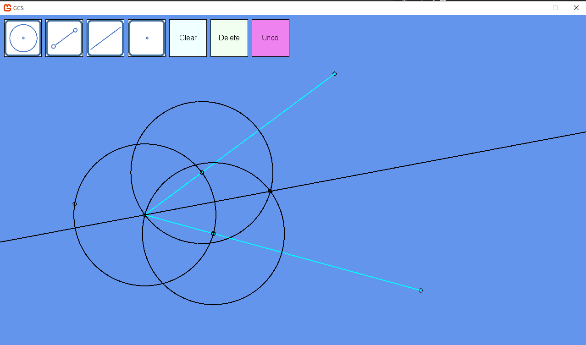

# GCS
Geometric Construction Simulator, 작도 시뮬레이션 프로그램

# 사용 방법

## 기본 조작

그릴 도형의 버튼을 클릭하고 (점, 선, 원), 드래그 엔 드랍으로 그린다.  드래그하여 도형을 움직이고, 클릭하여 선택된 도형은 다시 클릭하여 선택 해제한다.  Clear 버튼은 모든 도형을 지우고, Delete 버튼은 선택되어있는 도형들을 지운다.  Undo 버튼은 작업을 취소해야 하는데... `throw new WorkWoorimException("일해라 우림");`

## 도형 그리기

### 점

점은 모든 도형을 그리는데 기본이 되고, 점 찍기는 온 우주의 기운을 담아 찍어야 이쁘게 잘 찍힌다. 점은 주황색으로 표시되는 가까운 포커스된 도형 위에 찍어지고, 포커스되는 도형이 없다면 정확히 마우스의 위치에 찍어진다. 포커스된 도형이 여러개이면 도형의 교점에 찍히게 된다.

### 원

중심점이 될 위치에 마우스 다운 후 나머지 한 점이 될 위치에서 마우스 업

### 선분

한 점에서 마우스 다운 후 나머지 한 점이 될 위치에서 마우스 업

### 직선

[선분](#선분)과 같음

## 이동 규칙

선분이나 직선 위에 찍힌 점은 선이 움직이면 선을 이루는 두 점과의 비율에 맞춰 움직인다. 원 위에 찍힌 점은 각도가 고정되어 움직인다.  교점 위에 찍힌 점의 위치는 교점을 따라가게 된다.  다른 도형 위에 있는 점을 한 점으로 가지는 도형이 있다면, 다른 도형이 움직여 그 점이 움직인다면 자기 자신도 움직이게 된다.

# ToDo

- [ ] Undo 구현
- [ ] WinForm 으로 포팅
- [ ] 복사/붙여넣기
- [ ] 점 병합
